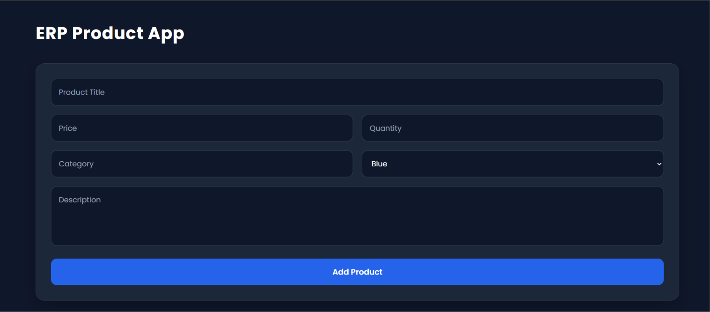

# ERP Product App

  A modern Product Management System that helps users manage products efficiently with a clean and responsive interface.

  <a href="https://erp-product-app.vercel.app" target="_blank">erp-product-app.vercel.app</a> •
  <a href="https://github.com/ahmedmubarak2010/ERP-Product-App">Source Code</a>

---

## 📌 About The Project

ERP Product App is a simple and modern Product Management System built using pure HTML, CSS, and JavaScript.

The application allows users to manage product data easily through a CRUD system:

- Create new products
- Read and display product information
- Update existing products
- Delete products
- Search products quickly
- Calculate total product values
- Store data using Local Storage

The project focuses on practicing JavaScript logic, DOM manipulation, and building a real-world management application without using external frameworks.

---

## ✨ Features

✅ Add new products  
✅ Edit product information  
✅ Delete products  
✅ Search and filter products  
✅ Automatic total calculation  
✅ Data persistence using Local Storage  
✅ Responsive modern UI  
✅ Simple and user-friendly design  

---

## 🛠 Technologies

- HTML5
- CSS3
- JavaScript (ES6)
- Local Storage
- Font Awesome

---

## 📸 Screenshots

  

---

## Contact Me

---

## Author

**Ahmed Mubarak**

Frontend Developer | JavaScript Developer
